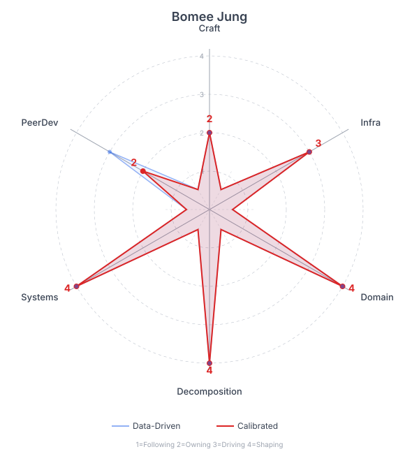

# Origami Self-Assessment: Bomee Jung

**Assessment period:** 2025-10-13 to 2026-04-13
**Generated:** 2026-04-13

## Origami Plot

*(Scores: 1=Following, 2=Owning, 3=Driving, 4=Shaping. Max=4.)*

| Domain | Data-Driven | Self-Assessment | Calibrated | Delta |
|--------|-------------|-----------------|------------|-------|
| Engineering Craft | 2 | strongly agree | 2 | = |
| Infra & Quality | 3 | agree | 3 | = |
| Domain Knowledge | 4 | agree | 4 | = |
| Decomposition | 4 | agree | 4 | = |
| Team Systems | 4 | agree | 4 | = |
| Peer Development | 3 | disagree | 2 | -1 |

**Calibrated total:** 19/24
**Calibrated progression:** C — Still C (three domains at 3+, Team Systems at 4). Peer Development drop doesn't change progression but reveals that the team multiplication gap is larger than the data suggested.

## Origami Shape

Radically asymmetric — a valley at Engineering Craft (2) with peaks at Domain Knowledge, Decomposition, and Team Systems (all 4). This is the AI-era leadership profile: doesn't write the code, but points the code-writers (human and AI) at the right problems with the right context. The value isn't in craft — it's in knowing *what to build*, *how to break it down*, and *how to make the team operate*.

The Peer Development score (3) is the honest gap. High review volume without developing independence means the team's ceiling is still bounded by one person's availability.

## Data-Driven Scores

### 1. Engineering Craft — 2 (Owning)

**Evidence:** Ships features and fixes at high volume (1,676 commits), but increasingly through AI scaffolding. Sets DDD patterns and identifies security issues (GraphQL injection, unescaped HTML), but through specs and review — not through deep personal craft. Output is correct because of domain knowledge and decomposition, not engineering craft per se. Does not independently lead security remediation campaigns.

### 2. Infrastructure & Quality Systems — 3 (Driving)

**Evidence:** Defines test strategy (behavioral assertion enforcement with arch test, behavioral tests for bug fixes). Creates CI policy (revert detection, merge queue). Schema contract tests for external service integration. Manages all releases. But operational infrastructure (deploys, scaling, monitoring) is owned by ***** — Bomee creates infra tickets but doesn't make deploy/scaling decisions.

### 3. Domain Knowledge — 4 (Shaping)

**Evidence:** Makes domain modeling calls no one else can: entity structure for complex property types, external service confidence scores vs nulls, eligibility checks as authoritative over presentation-layer checks, analysis period semantics. This is why AI-assisted output is correct — knows what "right" means in the compliance and domain-specific context. Knowledge that isn't in any ticket or spec.

### 4. Decomposition — 4 (Shaping)

**Evidence:** 1,140 self-authored issues (74% authorship ratio). Reads error tracking daily (4 structured tickets from a single triage session). Created the spec-driven development process. Writes specs that define work for the entire team (multi-standard architecture, ID deprecation, automated entity creation). Turns "we need X" into phased, sequenced engineering work.

### 5. Team Systems — 4 (Shaping)

**Evidence:** Designs the entire development methodology: spec-driven development process, team measurement system, AI-assisted scaffolding (Claude skills), review bot configuration, bug trend analysis, pre-release regression toolset. Codifies review findings into team rules. The meta-layer — designs how work gets done, not just doing it.

### 6. Peer Development — 3 (Driving)

**Evidence:** 569 PR reviews — 2-3x more than next highest reviewer. Sets review standards and expectations. But the quarterly lookback is clear: nobody else runs a release, writes specs, or does error triage. Review volume isn't translating to independence. If this were a 4, the team would be further along.

## Growth Signals

No progression transition signals (already at C). The relevant signals are for *shrinking the origami* — transferring capability to the team:
- *****'s release workflow ownership — emerging Infra & Quality
- *****'s self-directed N+1 campaign — emerging Infra & Quality
- *****'s post-merge security pipeline — already autonomous in Craft (security)
- *****'s regression tracking skill — early Team Systems signal

---

## Self-Calibration

*Completed interactively on 2026-04-13.*

### Engineering Craft

**Data-driven score:** 2 | **Self-assessment:** strongly agree
**Adjusted score:** 2

> "I don't care about craft, as long as the output is correct, and I'm more concerned about building AI scaffolding to get there than about beautiful code."

*No pushback. This is a deliberate strategic choice, not a gap — she invests in Domain Knowledge and Team Systems because those make AI output correct. Craft is table stakes, not a growth target.*

### Infrastructure & Quality Systems

**Data-driven score:** 3 | **Self-assessment:** agree
**Adjusted score:** 3

> "Similar deal as the engineering craft. I'm building system-wide scaffolding and enforcing structured data and access controls. I don't care about actual implementation and dotting all the i's — that's for *****. I care about having systems and routines in place, preferably automated, at minimum, documented."

*Agree holds. The 3 is right — she drives the quality systems layer (test strategy, CI policy, release checklists) but deliberately delegates operational infra. The split is intentional: she designs the systems, someone else runs them. Not a 4 because she doesn't define the infra approach.*

### Domain Knowledge

**Data-driven score:** 4 | **Self-assessment:** agree
**Adjusted score:** 4

> "I need to work on transferring domain knowledge — the team ought to be able to make these domain decisions. They're not going to catch up with me on stuff they've never heard of (i.e. depth/breadth), but stuff like 'team perms are atomic' should be available to everyone because it's already in the code base and discussed."

*Agree with self-critique attached. The 4 is accurate today — she is the sole person shaping domain modeling. But she identifies the transfer problem: some domain knowledge is genuinely deep while other knowledge is just undocumented decisions that should be discoverable. The growth target isn't raising the score — it's making the 4 less load-bearing by codifying the transferable parts (ADRs, spec annotations, code comments).*

### Decomposition

**Data-driven score:** 4 | **Self-assessment:** agree
**Adjusted score:** 4

> "Decomposition is my bag."

*No discussion needed. The data is overwhelming — 74% ticket authorship ratio, 1,140 self-authored issues, the spec-driven development process itself. This is the clearest 4 on the chart.*

### Team Systems

**Data-driven score:** 4 | **Self-assessment:** agree
**Adjusted score:** 4

> "Sure, agree, but this is an area where going at it alone has been detrimental to quality — for one thing, no one knows what all this tooling is, including me, because I've booted up so many that I've forgotten what they all do. We need a more team-curated approach."

*Important caveat. The score is 4 on output — she shapes the methodology. But there's a sustainability problem: the quarterly lookback flagged the same thing ("bus factor question: who else can modify or debug any of this?"). A solo-built tooling stack that the builder can't even inventory is a 4 that's about to become a liability. The growth target here isn't scoring higher — it's making the 4 durable by involving the team in curation, deprecating unused tools, and documenting the ones that matter.*

### Peer Development

**Data-driven score:** 3 | **Self-assessment:** disagree
**Adjusted score:** 2

> "I don't do great PR reviews because I don't have strong investment in craft. What I do is apply the tooling I've invested in to automate the reviews so that the output is correct. That's probably not really assisting peer development — other than by demonstrating tool use. Where I do 'drive' is in tooling the self-eval exercises and prompting folks on what I think they could lean into. That's not through PR review."

*Concede. The data-driven score conflated review volume with peer development — 569 reviews looks like a 3, but she's right that automated review tooling is Team Systems work, not Peer Development. The actual peer development is more informal: prompting growth directions, framing exercises like this origami assessment. That's a 2 (Owning) — self-directed mentoring without a formal system — not a 3 (Driving), because it hasn't yet produced sustained independence in others. Adjusted down to 2.*

---

## Growth Targets

1. **Peer Development (2 → 3): Build a peer development practice that isn't PR review volume.** The origami assessment skill is a start — it's a structured way to develop others. Concrete next-quarter target: run origami assessments with each team member, and have at least one person independently run a release and one independently write a spec. Measure by *their* output, not yours.

2. **Team Systems (4, but fragile): Curate the tooling stack with the team.** Inventory existing tools, deprecate what nobody uses, document what matters, and involve the team in deciding what gets built next. The 4 is real but unsustainable solo. Concrete next-quarter target: the team can name and use the top 5 tools without asking you.

3. **Domain Knowledge (4, transfer needed): Codify the transferable parts.** Distinguish deep domain knowledge (stays with you) from undocumented decisions (should be discoverable). Concrete next-quarter target: 10 ADRs or spec annotations for domain decisions that currently live only in your head.

## Starfish — Peer Development

- **Keep doing:** Prompting growth directions, framing self-eval exercises
- **More of:** Structured development conversations (like this origami calibration) with each team member
- **Less of:** Automated review as a substitute for actual mentoring
- **Stop:** Counting review volume as evidence of peer development
- **Start:** Delegating whole functions (releases, specs, triage) with coaching support rather than doing them and having others watch
